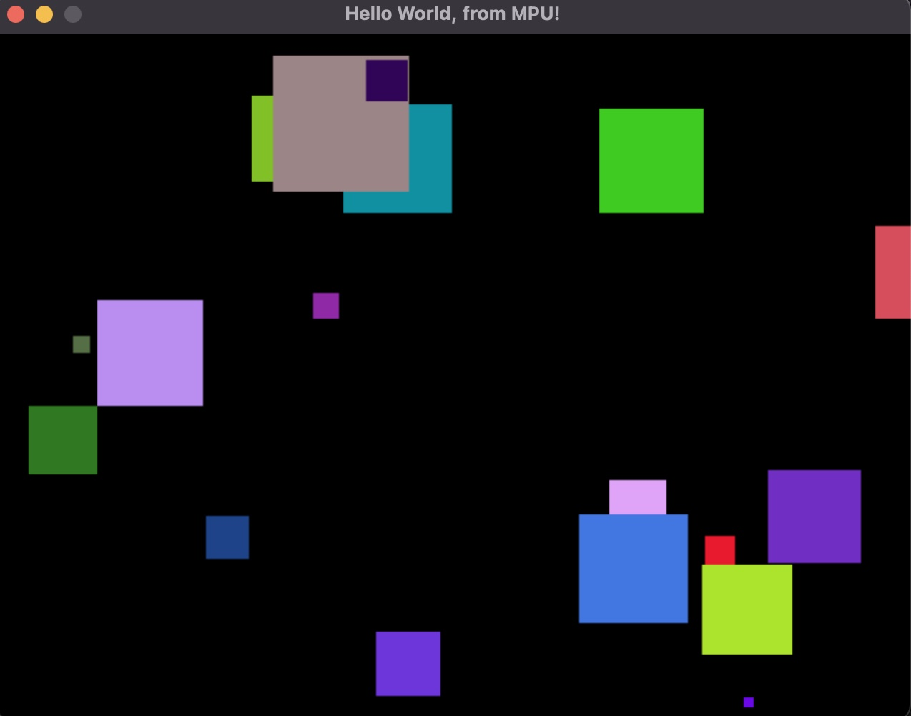

# Memory Processing Unit (MPU)

## Overview

MPU is a (virtual) 16 bit computer system, with a small enough instruction set to be easy to learn and play with but (hopefully) not so small that its just annoying.  At least, to someone used to assembly :) 

It is named MPU because it has no general purpose registers ... all operations are directly on main memory, of which there is 64Kb.  It has a Program Counter, a Stack Pointer, and Frame Pointer located in memory at address 0, 2, and 4 respectively.  There are also flags such as the carry flag, zero flag, negative flag.  

Features:

* 16 bit address space
* Instructions can operate on bytes or words
* Built in graphics, stdout, extensible hardware (could support network and file i/o easily)
* Stack can be anywhere in memory and grows downward
* Frame pointer makes it easy to write reusable/reentrant functions

MPU is also the name of a fictional US military satellite that became self-aware and decided to redraw giant animals on the face of the Earth using lasers to keep it company.


# Installation

## Homebrew (macOS)

```bash
brew tap jsando/tools
brew install mpu
```

After installation, you can find:
- Example programs in: `/usr/local/share/mpu/examples/` (Intel) or `/opt/homebrew/share/mpu/examples/` (Apple Silicon)
- Documentation in: `/usr/local/share/doc/mpu/` (Intel) or `/opt/homebrew/share/doc/mpu/` (Apple Silicon)

To run an example after homebrew installation:
```bash
# On Intel Macs
mpu run /usr/local/share/mpu/examples/hello.s

# On Apple Silicon Macs
mpu run /opt/homebrew/share/mpu/examples/hello.s
```

## Alternative: Build from Source

1. Ensure the Go toolchain is installed as per instructions on golang.org
2. Install SDL dependencies
3. go build
    
Dependencies for MacOS via [Homebrew](https://brew.sh):

```
brew install sdl2{,_image,_mixer,_ttf,_gfx} pkg-config
```

Dependencies for Ubuntu:

```
apt install pkg-config build-essential libsdl2{,-image,-mixer,-ttf,-gfx}-dev
```

For other operating systems see https://github.com/veandco/go-sdl2#installation

# Running

## Run a program

```
mpu run [-m] file

Runs the give file, which can be either a .bin or a .s.  If 
given a .s file it will assemble the file first and then run 
it.  This does not write to a .bin file, it runs directly from 
memory.

    -m      Load the program but start the system monitor, to 
    allow to inspect memory and single-step.
```

Ex, run hello world:

```
mpu run example/hello.s
```

## Compile .s to .bin

```
mpu build [-o output] files

Assembles one or more .s files into a .bin file, and produces 
an assembly listing to stdout.

    -o      Optional output path, if omitted the output is the 
    same name as the first input file with a ".bin" suffix.
```

## Run Unit Tests

```
mpu test [-v] [-color] files

Discovers and runs unit tests in assembly source files. Tests 
are defined using the 'test' keyword and use the SEA (Set 
Assertion) instruction for assertions.

    -v         Show verbose output (display all test names)
    -color     Colorize output (default: true)
```

Ex, run tests:

```
mpu test example/test_simple.s
mpu test -v example/test_*.s
```

## Format Source

```
mpu fmt file

Parse and pretty-print the input file to stdout.  If I ever 
get enough unit tests I'll add the flag to rewrite in place 
but for now redirect to a new file, diff and make sure it 
looks good, then rename or copy-paste.

```
# Examples

To run any of the examples use "mpu run example/name".

Here are some of the graphics examples.

## Drawing random filled rectangles 

```
mpu run example/graphics.s
```
Press ctrl-c in terminal to quit.


## 16-Segment LCD Display Font

```
mpu run example/lcd_test.s
```
Press esc to quit.


## Pong Game

```
mpu run example/pong.s
```
Press esc to quit.  
Press '1' for 1 player, '2' for 2 player.  
Player 1 controls are 'a' and 'z'.
Player 2 controls are 'l' and ','.


## Falling Blocks Game

```
mpu run example/blocks.s
```
Press esc to quit.  
Press space to start new game.
Press 'j' to move left.
Press 'l' to move right.
Press space to rotate piece.
Press 'k' to drop fast.


# MPU Specification

### Programming Model

Memory-mapped registers:

| Address   | 8 bits (lo)          | 8 bits (hi)          |
|-----------|----------------------|----------------------|
| 0x00      | Program Counter (lo) | Program Counter (hi) |
| 0x02      | Stack Pointer (lo)   | Stack Pointer (hi)   |
| 0x04      | Frame Pointer (lo)   | Frame Pointer (hi)   |
| 0x06      | IO Request (lo)      | IO Request (hi)      |
| 0x08      | IO Status (lo)       | IO Status (hi)       |
| 0x0a      | Random (lo)          | Random (hi)          |
| 0x0c-0x0f | Reserved             |                      |

### Flags

| Flag     | Power-On State | Usage                                                                 |
|----------|----------------|-----------------------------------------------------------------------|
| Zero     | Clear          | Set if last value written was zero, clear if not.                     |
| Negative | Clear          | Set if last value written had its high bit set.                       |
| Carry    | Clear          | Set / clear as used by add/sub.                                       |
| Bytes    | Clear          | Bytes flag if set all instructions operate on bytes instead of words. |

### Power On

An image is loaded to address 0x0000 in memory.  The image is expected to set the Program Counter to the main function.  The stack pointer can be left at 0x0000, which will let it grown downward starting from 0xffff for the first value (or it can be set to any arbitrary address above 0x10).  Loading the initial image into RAM does not set the IO or RNG registers however.

Once the image is loaded, execution begins at the address pointed to be the Program Counter.

Instructions are encoded in variable-length packets.  Opcodes are always 1 byte, and depending on the addressing mode are followed by zero to 4 additional bytes.

There is no built-in firmware, operating system, interpreter, etc.  Program images for MPU are sort of like game catridges ... whatever is in there when you power it on, that's what you've got.  Programs can use the full 64Kb address space for code and data.

Speaking of code and data, much like a 1980's era computer there is no separation.  Code is free to write data anywhere, or even output code dynamically and then invoke it.

## Byte vs Word Modes

MPU has a "bytes mode" flag, which can switch MPU into byte mode.  In this mode all instructions operate on bytes instead of words.  At startup, the bytes flag is cleared therefore at startup MPU always starts in word mode (16 bit).

Words are stored low byte first.

To enable bytes mode, use 'seb'.  To enable word mode, use 'clb'.  These instructions "set" or "clear" the bytes flag.

## Instructions

Instructions that take two operands, such as 'add', perform the operation specified and store the result in the address of the first operand.

For example,

    add a, b

Is effectively:

    a = a + b

* Hlt - Halt processing.  If run from the command line this signals an exit.
* Add - Add, with carry.  a += b
* Sub - Subtract, with carry. a -= b
* Mul - multiply. a *= b
* Div - divide.  a /= b
* And - bitwise and.  a &= b
* Or - bitwise or.  a |= b
* Xor - bitwise exclusive-or.  a ^= b
* Cpy - copy. a = b
* Cmp - Compare.  Its like sub but without storing the result, but it updates the flags.
* Inc - Increment by 1.  Can use clc/add but this is shorter.
* Dec - Decrement by 1.  Can use sec/sub but this is shorter.
* Psh - Push operand on the stack.
* Pop - Pop values off the stack.
* Jsr - Jump to subroutine.  Pushes the return address on the stack, so ret/rst can return.
* Jmp - Unconditional jump.  Like goto.  Operand is a 16 bit address.
* Jeq - Jump if equal/zero.  Operand is 8 bit offset, max 127/-128.
* Jne - Jump if not equal/not zero.  Operand is 8 bit offset, max 127/-128.
* Jge - Jump if greater than or equal to.  Operand is 8 bit offset, max 127/-128.
* Jlt - Jump if less than. Operand is 8 bit offset, max 127/-128.
* Jcc - Jump if carry clear.  Operand is 8 bit offset, max 127/-128.
* Jcs - Jump if carry set.  Operand is 8 bit offset, max 127/-128.
* Sav - Save the framepointer, set it to the stack pointer, and allocate space for local vars (#bytes).
* Seb - Set bytes mode flag.
* Clb - Clear bytes mode flag.
* Clc - Clear carry flag.
* Sec - Set carry flag.
* Sea - Set assertion flag (for unit tests - affects next CMP instruction).
* Ret - Return from subroutine, using 16 bit address on top of stack.
* Rst - Restore framepointer and return from subroutine.

## Address Modes

The following address modes are supported:

* Implied - operand(s) are implied by the instruction.  Ex, "ret" returns from subroutine using the address on the top of the stack.
* Immediate (#) - operand is a constant values encoded following the instruction.  Usually indicated with a number sign in soure code, ie "#1000" means "the number 1000", as opposed to "the value at address location 1000".  Most instructions using immediate mode will use the '#' to indicate as such, however the jump instructions allow it to be omitted since they *only* work with immediate mode.
* ImmediateByte (#b) - at least one instruction supports a single-byte immediate value and that is 'pop #', which pops and discards the given number of bytes from the stack.
* OffsetByte (ob) - Operand is a relative offset from the current program counter to the jump target.  Used by conditional jumps, it means the jump can be +127/-128 bytes forward/backward.
* Absolute (a) - Operand(s) refer to the value at the given 16 bit memory address.  Ie, "0" means "the value stored at address 0, which would be the program counter (the address of the current instruction being executed).
* Indirect (*) - Operand(s) refer to an address, which contains an address which contains a value.  If memory locations 100 and 101 contain "20 20", and location 2020 contains "12 34", then *100 is 12 34.
* Relative (r) - frame pointer relative 8 bit offset. Operand is a signed 8 bit offset which is added to the current value of the Frame Pointer register (addresses 0x04/0x05) to determine the final address to use.
* Relative Indirect (*r) - frame pointer relative 8 bit offset, as an indirect reference.

One of the ways the 6502 reduced the number of bytes of a program was by leveraging "zero page" modes, which allowed a single byte to refer to a 16-bit pointer.  MPU gains a similar benefit by using frame-pointer relative addressing with a single byte.  The benefit over zero page is it makes it much easier to write reusable functions, since they aren't using global variables.

## Opcodes (left column is high nibble, top is low nibble)

|       |     0     |     1     |     2     |     3     |     4     |    5     |     6     |     7     |    8     |     9     |     A     |     B     |    C     |    D     |     E     |     F     |
|:-----:|:---------:|:---------:|:---------:|:---------:|:---------:|:--------:|:---------:|:---------:|:--------:|:---------:|:---------:|:---------:|:--------:|:--------:|:---------:|:---------:|
| **0** |    hlt    |           |           |           |           |          |           |           |          |           |           |           |          |          |           |           |
| **1** |  add a,a  |  sub a,a  |  mul a,a  |  div a,a  |  and a,a  |  or a,a  |  xor a,a  |  cpy a,a  | add a,#  |  sub a,#  |  mul a,#  |  div a,#  | and a,#  |  or a,#  |  xor a,#  |  cpy a,#  |
| **2** |  add a,*  |  sub a,*  |  mul a,*  |  div a,*  |  and a,*  |  or a,*  |  xor a,*  |  cpy a,*  | add a,r  |  sub a,r  |  mul a,r  |  div a,r  | and a,r  |  or a,r  |  xor a,r  |  cpy a,r  |
| **3** | add a,*r  | sub a,*r  | mul a,*r  | div a,*r  | and a,*r  | or a,*r  | xor a,*r  | cpy a,*r  | add *,a  |  sub *,a  |  mul *,a  |  div *,a  | and *,a  |  or *,a  |  xor *,a  |  cpy *,a  |
| **4** |  add *,#  |  sub *,#  |  mul *,#  |  div *,#  |  and *,#  |  or *,#  |  xor *,#  |  cpy *,#  | add *,r  |  sub *,r  |  mul *,r  |  div *,r  | and *,r  |  or *,r  |  xor *,r  |  cpy *,r  |
| **5** | add *,*r  | sub *,*r  | mul *,*r  | div *,*r  | and *,*r  | or *,*r  | xor *,*r  | cpy *,*r  | add r,a  |  sub r,a  |  mul r,a  |  div r,a  | and r,a  |  or r,a  |  xor r,a  |  cpy r,a  |
| **6** |  add r,#  |  sub r,#  |  mul r,#  |  div r,#  |  and r,#  |  or r,#  |  xor r,#  |  cpy r,#  | add r,*  |  sub r,*  |  mul r,*  |  div r,*  | and r,*  |  or r,*  |  xor r,*  |  cpy r,*  |
| **7** |  add r,r  |  sub r,r  |  mul r,r  |  div r,r  |  and r,r  |  or r,r  |  xor r,r  |  cpy r,r  | add r,*r | sub  r,*r | mul  r,*r | div  r,*r | and r,*r | or  r,*r | xor  r,*r | cpy  r,*r |
| **8** | add *r,a  | sub *r,a  | mul *r,a  | div *r,a  | and *r,a  | or *r,a  | xor *r,a  | cpy *r,a  | add *r,# | sub *r,#  | mul *r,#  | div *r,#  | and *r,# | or *r,#  | xor *r,#  | cpy *r,#  |
| **9** | add  *r,* | sub *r,*  | mul *r,*  | div *r,*  | and *r,*  | or *r,*  | xor *r,*  | cpy *r,*  | add *r,r | sub *r,r  | mul *r,r  | div *r,r  | and *r,r | or *r,r  | xor *r,r  | cpy *r,r  |
| **A** | add *r,*r | sub *r,*r | mul *r,*r | div *r,*r | and *r,*r | or *r,*r | xor *r,*r | cpy *r,*r |          |           |           |           |          |          |           |           |
| **B** |   psh a   |   pop a   |   inc a   |   dec a   |    sec    |   clc    |    seb    |    clb    |   ret    |    rst    |  sav #b   |           |          |          |           |           |
| **C** |   psh *   |   pop *   |   inc *   |   dec *   |  cmp a,#  | cmp a,a  |  cmp a,*  |  cmp a,r  | cmp a,*r |  cmp *,#  |  cmp *,a  |  cmp *,*  | cmp *,r  | cmp *,*r |  cmp r,#  |  cmp r,a  |
| **D** |   psh r   |   pop r   |   inc r   |   dec r   |  cmp r,*  | cmp r,r  | cmp r,*r  | cmp *r,#  | cmp *r,a | cmp *r,*  | cmp *r,r  | cmp *r,*r |          |          |           |           |
| **E** |  psh *r   |  pop *r   |  inc *r   |  dec *r   |   jmp #   |  jeq ob  |  jne ob   |  jge ob   |  jlt ob  |  jcc ob   |  jcs ob   |   jsr #   |          |          |           |           |
| **F** |   psh #   |  pop #b   |           |           |           |          |           |           |          |           |           |           |          |          |           |           |

# Input/Output

MPU can have awesome graphics adapters and other things attached easily using the Peripheral Management Interface (PMI).  The PMI is accessed from code by writing to address 0x06, and reading the status of a prior request from address 0x08.  The value written to the PMI request register at 0x06 must be a (16 bit) pointer to memory which contains the actual request.  All requests start with a 2-byte header that includes the device id and request number, followed by additional parameters depending on the type of request.

Here is an example to write "Hello, world!" to standard output:

```
                dw main          // Set initial PC to start at main
                org 0x10
main:
                cpy 0x06,#myreq
                hlt 

myreq:          dw 0x0101       // stdout / putchars
                dw hello        // pointer to zero terminated string
hello:          db "Hello, world!",0x0a,0x00

```

## Standard In/Out

There is not yet a standard input device request.

Write to stdout:

```
Id       uint16 // 0x0101
PZString uint16 // pointer to zero-terminated string
```

## SDL Graphics & Sound

This is a prototype to test out the PMI thingy and seems to be working pretty well, although I intended to do a retained-mode graphics interface because I figured that would be better for having only 64Kb.

To use the SDL hardware, see the sample program "example/graphics.s".  Basically the steps are:

* Initialize
* In a loop:
    * Poll Events, quit if main window closed
    * Clear screen
    * Draw screen
    * Present screen (with optional pause)
    * Loop

SDL Initialize (Open Window):

Create an SDL window, it will remain until the program terminates.

```
Id     uint16 // 0x0201
Width  uint16 // Window with in pixels
Height uint16 // Window height in pixels
Title  uint16 // Pointer to zstring
```

Poll Events:

This must be called in a main loop to dequeue events like mouse movement, keyboard events, and window events.

```
Id        uint16    // 0x0202
EventType uint16    // SDL event type if < 65536 (see https://wiki.libsdl.org/SDL_Event)
Timestamp uint16    // Event timestamp as 1/4 second since SDL init
Data      [4]uint16 // moar response (right now, just 16 bit KeyCode if its a keyevent)
```

Present:

```
Id      uint16      // 0x0203
DelayMS uint16      // Optional delay in milliseconds, 0-65535 (16 = 60fps approx)
```

Clear Screen:

Clear the window to the current draw color.

```
Id uint16           // 0x0204
```

Set Draw Color:

Sets the current drawing color, for subsequent clear, drawline, drawrect, or fillrect.

```
Id         uint16   // 0x0205
R, G, B, A uint8    // Red, Green, Blue, Alpha as values in range 0-255
```

Draw Line:

```
Id             uint16   // 0x0206
X1, Y1, X2, Y2 uint16   // Draw line from (x1,y1) to (x2,y2)
```

Draw Rectangle:

Draw an emptyrectangle using lines in the current draw color.

```
Id         uint16       // 0x0207 
X, Y, W, H uint16       // Draw a rectangle from (x,y) to (x+w-1,y+h-1)
```

Filled Rectangel:

Draw a colored rectangle in the current draw color.

```
Id         uint16       // 0x0207 
X, Y, W, H uint16       // Draw a rectangle from (x,y) to (x+w-1,y+h-1)
```

Get Ticks:

Get the number of seconds elapsed since SDL init was called.

```
Id    uint16      // 0x0209
Ticks uint16      // Return value
```

Initialize SDL Audio:

Must be called once before loading or playing any sound files.

```
Id uint16   // 0x020a
```

Load WAV File:

Load a WAV audio file in preparation to be played.  These are used as sound effects.

```
Id   uint16 // 0x020b
Path uint16 // Pointer to zero-terminated string, path to .wav file (relative to .bin/.s)
```

Play WAV File:

Play the previously loaded WAV file of the same name.  Can be called numerous times on the same path.

```
Id   uint16 // 0x020b
Path uint16 // Pointer to zero-terminated string, path to .wav file (relative to .bin/.s)
```

# System Monitor

The monitor is a most primitive type of way to step through a program and inspect memory.  Start a program in the monitor by launching with -m:

```
mpu run -m example/hello.s
```

Commands:

* d/dump [start [end]]
* l/list [start]
* set [address value [value]*]
* run address
* s/step [address]

Example:

```
> dump 0x0
0000  00 01 00 00 00 00 00 00 00 00 48 94 00 00 00 00  |..........H.....|
0010  00 00 00 00 00 00 00 00 00 00 00 00 00 00 00 00  |................|
0020  00 00 00 00 00 00 00 00 00 00 00 00 00 00 00 00  |................|
0030  00 00 00 00 00 00 00 00 00 00 00 00 00 00 00 00  |................|
0040  00 00 00 00 00 00 00 00 00 00 00 00 00 00 00 00  |................|
0050  00 00 00 00 00 00 00 00 00 00 00 00 00 00 00 00  |................|
0060  00 00 00 00 00 00 00 00 00 00 00 00 00 00 00 00  |................|
0070  00 00 00 00 00 00 00 00 00 00 00 00 00 00 00 00  |................|
0080  00 00 00 00 00 00 00 00 00 00 00 00 00 00 00 00  |................|
0090  00 00 00 00 00 00 00 00 00 00 00 00 00 00 00 00  |................|

> list 0x100
0x0100  ba 02          sav #0x02
0x0102  67 fe 0a 00    cpy fp-2,#0x000a
0x0106  1f 06 00 00 10 cpy 0x0006,#0x1000
0x010b  d3 fe          dec fp-2
0x010d  e6 f9          jne 0x0106 (-7)
0x010f  00             hlt 
0x0110  00             hlt 
0x0111  00             hlt 
0x0112  00             hlt 
0x0113  00             hlt 
0x0114  00             hlt 
0x0115  00             hlt 
0x0116  00             hlt 
0x0117  00             hlt 
0x0118  00             hlt 
0x0119  00             hlt 
0x011a  00             hlt 
0x011b  00             hlt 
0x011c  00             hlt 
0x011d  00             hlt 

> step 0x100
0x0100  ba 02          sav #0x02
[status pc=0102 sp=fffc fp=fffe n=0 z=0 c=0 b=0]
> s
0x0102  67 fe 0a 00    cpy fp-2,#0x000a
[status pc=0106 sp=fffc fp=fffe n=0 z=0 c=0 b=0]
> s
0x0106  1f 06 00 00 10 cpy 0x0006,#0x1000
Hello, world!

```
# Assembler

The quickest way to learn the assembler syntax is to look as some of the examples.

## Symbols

There are 4 types of symbols:

* Equates, which are constants
* Labels, which are defined as the current value of the program counter
* Functions, which are labels that include special handling for the frame pointer
* Variables, which are labels within a function that refer to a frame pointer offset

Equates and labels can be global in scope, or local to the preceding global label if prefixed with a dot ".".

## Equates

Equates define constants, although expressions can be used and forward references are allowed.

Examples:

```
SCREEN_WIDTH    = 640
SCREEN_HEIGHT   = 480
PADDING         = 25
BOARD_HEIGHT    = SCREEN_HEIGHT - 2*PADDING
CELL_SIZE       = BOARD_HEIGHT /25
BOARD_X         = (SCREEN_WIDTH / 2 - 6 * CELL_SIZE)
BOARD_Y         = PADDING
MASK            = 1 << 15

SomeLabel:
.local-equate   = 25        // a local equate is only visible within the current global label scope
```

## Labels

Global labels are an identifier followed by ':', and define that symbol to have the value of the Program Counter at that position within the program.

Example:

```
my-label:
```

Local labels are prefixed with '.' and are scoped to the previous symbol.  This means they are only visible until the next global symbol is defined, and it means the same local label can be reused.

```
foo:
.loop
.exit

bar:
.loop
.exit
```

## Functions & Variables

This is an optional feature to simplify using the frame pointer relative modes, which require specifying an offset such as 'fp+2' or 'fp-4'.  The function declaration lists the incoming stack contents, and variable declarations define local variables.  The assembler assigns symbols to offsets and generates a "SAV #" instruction to adjust the stack pointer to allocate space for the locals.

If using a function instead of a simple label, the assembler will automatically convert a 'ret' (return from subroutine) into a 'rst' (restore and return).

Functions are declared as a label with a parameter list in parenthesis:

Example:

```
Itoa(value word, buffer word, bsize word):
    var next word
    var t1 word
    var t2 word
    ...    
```

## Unit Tests

MPU includes a built-in unit testing framework that allows you to write tests directly in assembly. Tests are defined using the `test` keyword followed by a function name.

### Writing Tests

Tests are declared similar to functions but with the `test` keyword:

```
test TestAddition():
    cpy a, #5
    add a, #3
    sea         // Set assertion flag
    cmp a, #8   // Assert that a equals 8
    ret
```

### Assertions

The `sea` (Set Assertion) instruction sets a flag that causes the next `cmp` instruction to act as an assertion. If the comparison fails (values are not equal), the test fails and the failure location is recorded.

### Running Tests

Use the `mpu test` command to run tests:

```
mpu test mytest.s
mpu test -v test_*.s    // Verbose output
```

Failed assertions show the source code location and expected vs actual values:

```
✗ TestAddition
  at test.s:25
    24 |     sea
    25 |     cmp result, #10
    26 |     ret
  
  Expected: 10
  Actual: 5
```

For each parameter the assembler needs to know the size (byte or word) so it can allocate 1 or 2 bytes.  In the example above, there are 3 word parameters passed in on the stack.  The stack also contains the return address.

Frame pointer and stack pointer, and values for each local label:

|        | Content             | Offset |
|--------|---------------------|--------|
|        | param 'value'       | fp+8   |
|        | param 'buffer'      | fp+6   |
|        | param 'bsize'       | fp+4   |
|        | jsr return address  | fp+2   |
| fp --> | saved frame pointer | fp+0   |
|        | var 'next'          | fp-2   |
|        | var 't1'            | fp-4   |
| sp --> | var 't2'            | fp-6   |

What all this does is mean instead of typing 'cpy fp-2,fp+4' you can write 'cpy next,bsize' and the assembler takes care of the offsets for you.

## Define space

These directives allocate space.

* ds expr - Define space, number of bytes specified by expr.  Ie "ds 10" will emit 10 bytes (zeroes) at the current program counter.
* db expr[,expr] - Define bytes. Comma separate list of expressions or strings.  Each value is output as a byte.
* dw expr[,expr] - Define words. Comma separate list of expressions or strings.  Each value is output as a word, low byte first.

For example to declare a global variable 'MyVar' that holds a word, with initial value 5:

```
MyVar:  dw 5            // Emits bytes 0x05 0x00
```

## Import

Use the 'import' directive to append another assembly source file to the end of the current one, if it hasn't already been included.  It is like 'include' except it always appends the given path after processing the current source file.

Example:

```
    import "strconv.s"
    import "random.s"
```

## Assembly Grammar

line :=
        label
    |   label instruction
    |   instruction
    |   function
    |   test
    |   equate
    |   vardecl
    |   import

import :=
        'import' string

label := 
        ident ':'
    |   .ident

equate := 
        ident '=' expr
    |   .ident '=' expr

function :=
        ident '(' param-list ')' ':'

test :=
        'test' ident '(' ')' ':'

vardecl :=
        'var' ident ['byte' | 'word']

instruction :=
        keyword [operand[,operand]*]

Operand  :=
      '#' expr
    | '*' expr
    | expr

expr :=
    MulExpr [ ('+' | '-' | '|' | '^') MulExpr]*

MulExpr :=
    UnaryExpr ['*' | '/' | '%' | '<<' | '>>'  UnaryExpr]*

UnaryExpr :=
    ['+' | '-'] PrimaryExpr

PrimaryExpr :=
      '(' expr ')'
    | Identifier
    | Literal (int, String, Char)

## Background

I was working my way through the 2021 Advent of Code puzzles to practice TDD in Go, and I lost motivation.  I remembered in years past how much I enjoyed when the puzzles involved building a virtual machine.  Pulled up some old notes on making a 6502 emulator, and then thought "hey that's been done a bunch, just do something fun".  I came up with the instruction set and wrote the basic machine pretty quickly, then decided to build an assembler for it, then a code reformatter (like go fmt), then add a graphics adapter ... it kind of just keeps growing on its own.

I studied and borrowed a bit from the Go assembler and cli tools along the way.  Also stole a bit from a BASIC compiler I wrote in Java many years ago (another fun weekend project).

I think teaching programming using a system like this can be powerful.  Not to really young kids, where Scratch may be a better choice, but to tweens and up let's say ... anyone with enough typing skills to move to a text-based language.  It's great to give folks an intro to programming using python or javascript, but I've seen a lot of developers skip over bits/nibbles/bytes and therefore are missing some core machine sympathy.  For MPU I was trying to strike a balance between low-level machine and "easy to get some pretty rectangles on the screen".


